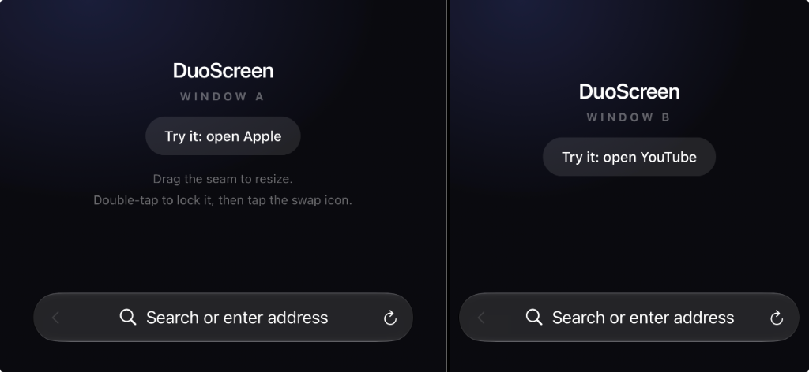

# DuoScreen — Dual-Screen Web Browser for iPhone


**Try the dual-screen phone experience on the iPhone you already own.** DuoScreen is a free, open-source iOS app that puts two real web browsers on one screen — split-screen browsing, a draggable divider, and dual video playback. No new hardware required.

Dual-screen and foldable phones sell multitasking as their headline feature — but you don't need a new device to find out if two-at-once browsing fits your life. iOS can't natively split the screen; DuoScreen fills that gap so you can experience an "iPhone Duo"-style workflow *before* you buy.



## Features

- **Two websites, one screen** — fully independent browser panes, each with its own navigation, history, and media playback
- **Dual video & audio playback** — watch a stream in one pane while reading in the other; both play sound simultaneously
- **Draggable split divider** — resize panes live with smooth GPU transforms; double-tap to lock the split *and* pin the screen orientation
- **Pane swap** — trade the panes' positions without reloading either page
- **Safari-style chrome** — per-pane bottom bar (back, search/address pill, reload) that auto-hides as you scroll
- **Liquid Glass UI** — built with Apple's iOS 26 `.glassEffect` APIs
- **Keeps sites in-app** — universal links (YouTube, Maps, store redirects) stay inside the pane instead of bouncing out to native apps
- **Private by design** — no accounts, no analytics, no tracking; browsing never leaves the device

## Build & install

Requires Xcode and iOS 26+. `ios/` is the whole app — three Swift files.

```bash
cd ios && xcodegen && open DuoScreen.xcodeproj
```

In Xcode: select the **DuoScreen** target → **Signing & Capabilities** → choose your team (a free Apple ID works, 7-day cert) → plug in your iPhone → **Run**. On first launch, trust the developer profile under **Settings → General → VPN & Device Management**.

## How it works

Native SwiftUI: two `WKWebView`s in explicit rects — stacked in portrait, side-by-side in landscape. The 3pt seam drags with presentation transforms for jank-free resizing, and locks with a double-tap. See `AGENTS.md` for the full architecture.

## Privacy

DuoScreen collects no data — see `PRIVACY.md`.

## License

MIT — see `LICENSE`.
